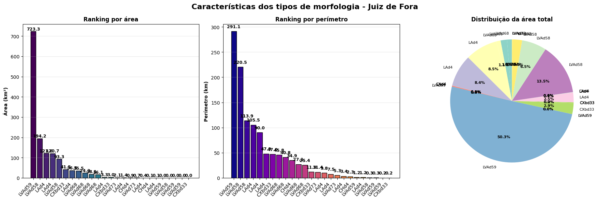
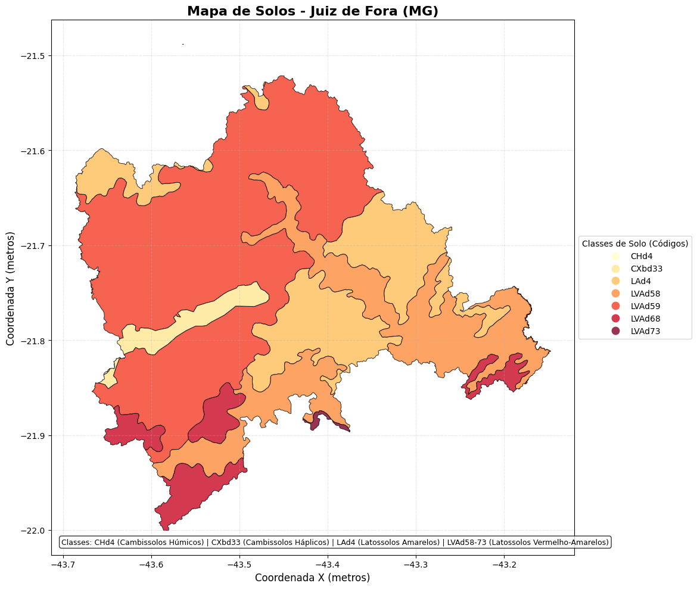

# Mapeamento geomorfológico de Juiz de Fora

### Introdução

O **SISURB** - **Sistema Municipal de Informações para o Desenvolvimento Territorial** desenvolve e organiza dados para mapeamento do território de Juiz de Fora, em seus aspectos topográficos, geológicos e geográficos.

São disponibilizados diversos mapas temáticos, dentre os quais o de solos, que contém a classificação dos solos do município, com a descrição de sete classes diferentes: Cambissolos Húmicos, Cambissolos Háplicos, Latossolos Amarelos, Latossolos Vermelho-Amarelos, Latossolos Vermelho-Amarelos, Latossolos Vermelho-Amarelos, Latossolos Vermelho-Amarelos.

### Objetivo

Este projeto tem como objetivo construir o mapa dos solos de Juiz de Fora, a partir dos dados disponibilizados pelo **SISURB**. 

### Importamos as bibliotecas


```python
import os
import zipfile
import geopandas as gpd
import pandas as pd
import numpy as np
import matplotlib.pyplot as plt
import folium
from folium import plugins
from folium.plugins import Fullscreen
import rasterio
from rasterio.mask import mask
from shapely.geometry import mapping
from tqdm import tqdm 
import warnings
warnings.filterwarnings('ignore')
```

### Configuramos os diretórios

Configuramos os diretórios, para baixar manualmente o arquivo SOLOS.zip do repositório oficial (https://www.pjf.mg.gov.br/desenvolvimentodoterritorio/sistema_informacoes/solos.php).


```python
PATH_ZIP = "SOLOS.zip"
PATH_EXTRACTED = "JF_Solos_JF"
```

### Extraímos o shapefile

*Shapefile* é um arquivo digital que contém a representação geográfica vetorial do objeto geoespacial.


```python
if not os.path.exists(PATH_EXTRACTED):
    print("Descompactando arquivo ZIP...")
    with zipfile.ZipFile(PATH_ZIP, 'r') as zip_ref:
        # Extrai TODOS os arquivos do shapefile
        shapefile_extensions = ['.shp', '.shx', '.dbf', '.prj', '.cpg', '.sbn', '.sbx']
        essential_files = [f for f in zip_ref.namelist() 
                          if any(f.endswith(ext) for ext in shapefile_extensions)]
        
        print(f"Encontrados {len(essential_files)} arquivos do shapefile")
        for file in tqdm(essential_files, desc="Extraindo"):
            zip_ref.extract(file, PATH_EXTRACTED)
```

    Descompactando arquivo ZIP...
    Encontrados 35 arquivos do shapefile


    Extraindo: 100%|████████████████████████████████| 35/35 [00:00<00:00, 52.85it/s]


### Carregamos o shapefile


```python
gdf = gpd.read_file(f"{PATH_EXTRACTED}/Solos.shp")
```

### Definimos o CRS

Definimos o *Sistema de Referência de Coordenadas* (**CRS**) para o modelo **WGS84** (*World Geodesic System 1984*), que é o padrão adotado pelo *Folium*.


```python
gdf = gdf.to_crs(epsg=4326)
```

### Visualizamos o GeoDataFrame

Um *GeoDataFrame* é uma estrutura de dados tabular da biblioteca **GeoPandas** (baseada no **Pandas**) que estende os *DataFrames* comuns para armazenar e manipular dados espaciais. Ele obrigatoriamente contém uma coluna especial chamada *geometry*, que armazena as coordenadas geoespaciais e permite operações como cálculo de áreas ou distâncias


```python
gdf.iloc[:4]
```

<div>
<table border="1" class="dataframe">
  <thead>
    <tr style="text-align: right;">
      <th></th>
      <th>OBJECTID</th>
      <th>OBJECTID_1</th>
      <th>UM</th>
      <th>FIRST_CLAS</th>
      <th>FIRST_PORC</th>
      <th>FIRST_CL_1</th>
      <th>FIRST_PO_1</th>
      <th>FIRST_CL_2</th>
      <th>FIRST_PO_2</th>
      <th>FIRST_CL_3</th>
      <th>...</th>
      <th>Vegetaçã</th>
      <th>TIPO</th>
      <th>LEVANTAMEN</th>
      <th>classe</th>
      <th>SHAPE_Leng</th>
      <th>SHAPE_Area</th>
      <th>geometry</th>
      <th>AREA_KM2</th>
      <th>PERIM_KM</th>
      <th>CLASSE</th>
    </tr>
  </thead>
  <tbody>
    <tr>
      <th>0</th>
      <td>1</td>
      <td>21.0</td>
      <td>None</td>
      <td>None</td>
      <td>0</td>
      <td>None</td>
      <td>0</td>
      <td>None</td>
      <td>0</td>
      <td>None</td>
      <td>...</td>
      <td>Fase Floresta Tropical Subperenifólia</td>
      <td>LVAd68</td>
      <td>1</td>
      <td>1</td>
      <td>27146.113453</td>
      <td>1.810461e+07</td>
      <td>POLYGON ((-43.63415 -21.8783, -43.63389 -21.87...</td>
      <td>18.104611</td>
      <td>27.146113</td>
      <td>Latossolos Vermelho-Amarelos</td>
    </tr>
    <tr>
      <th>1</th>
      <td>2</td>
      <td>22.0</td>
      <td>None</td>
      <td>None</td>
      <td>0</td>
      <td>None</td>
      <td>0</td>
      <td>None</td>
      <td>0</td>
      <td>None</td>
      <td>...</td>
      <td>Fase Floresta Tropical Subperenifólia</td>
      <td>LVAd68</td>
      <td>1</td>
      <td>1</td>
      <td>25357.789586</td>
      <td>2.428209e+07</td>
      <td>POLYGON ((-43.50649 -21.85235, -43.50644 -21.8...</td>
      <td>24.282088</td>
      <td>25.357790</td>
      <td>Latossolos Vermelho-Amarelos</td>
    </tr>
    <tr>
      <th>2</th>
      <td>3</td>
      <td>24.0</td>
      <td>None</td>
      <td>None</td>
      <td>0</td>
      <td>None</td>
      <td>0</td>
      <td>None</td>
      <td>0</td>
      <td>None</td>
      <td>...</td>
      <td>Fase Floresta Tropical Subperenifólia</td>
      <td>LVAd68</td>
      <td>1</td>
      <td>1</td>
      <td>45812.482211</td>
      <td>1.607142e+07</td>
      <td>MULTIPOLYGON (((-43.18073 -21.81434, -43.17968...</td>
      <td>16.071423</td>
      <td>45.812482</td>
      <td>Latossolos Vermelho-Amarelos</td>
    </tr>
    <tr>
      <th>3</th>
      <td>4</td>
      <td>30.0</td>
      <td>None</td>
      <td>None</td>
      <td>0</td>
      <td>None</td>
      <td>0</td>
      <td>None</td>
      <td>0</td>
      <td>None</td>
      <td>...</td>
      <td>Fase Floresta Tropical Subperenifólia</td>
      <td>LAd4</td>
      <td>1</td>
      <td>2</td>
      <td>90004.539458</td>
      <td>1.216135e+08</td>
      <td>POLYGON ((-43.41985 -21.7242, -43.42078 -21.72...</td>
      <td>121.613475</td>
      <td>90.004539</td>
      <td>Latossolos Amarelos</td>
    </tr>
  </tbody>
</table>
<p>25 rows × 59 columns</p>
</div>


### Tratamento de dados

Para reaproveitamento do código utilizado para análise geomorfológica, renomeamos a coluna "UM_SEQ" e adicionamos a coluna "CLASSE", com uso de dicionário de mapeamento código -> classe.


```python
gdf = gdf.rename(columns={'UM_SEQ': 'TIPO'})

# Dicionário de mapeamento código -> classe
mapeamento_classes = {
    'CHd4': 'Cambissolos Húmicos',
    'CXbd33': 'Cambissolos Háplicos',
    'LAd4': 'Latossolos Amarelos',
    'LVAd58': 'Latossolos Vermelho-Amarelos',
    'LVAd59': 'Latossolos Vermelho-Amarelos',
    'LVAd68': 'Latossolos Vermelho-Amarelos',
    'LVAd73': 'Latossolos Vermelho-Amarelos'
}

# Criar a coluna CLASSE usando o mapeamento
gdf['CLASSE'] = gdf['TIPO'].map(mapeamento_classes)
```

### Analisamos as classes geomorfológicas


```python
# Criar tabela comparativa
print("\n" + "="*85)
print("TABELA COMPARATIVA DAS CLASSES DE SOLO")
print("="*85)

# Calcular métricas adicionais
gdf['AREA_KM2'] = gdf['SHAPE_Area'] / 1_000_000
gdf['PERIM_KM'] = gdf['SHAPE_Leng'] / 1000
#gdf['COMPACIDADE'] = (2 * np.sqrt(np.pi * gdf['AREA_KM2'])) / gdf['PERIM_KM'] * 100
#gdf['DENSIDADE'] = gdf['PERIM_KM'] / np.sqrt(gdf['AREA_KM2'])

# Ordenar por área
gdf_sorted = gdf.sort_values('AREA_KM2', ascending=False)

# Criar tabela formatada
print(f"\n{'TIPO':<15} {'CLASSE':<30} {'ÁREA (km²)':>12} {'PERÍMETRO (km)':>15}")
print("-"*85)

for idx, row in gdf_sorted.iterrows():
    tipo = row['TIPO'][:14]  # Limitar tamanho
    classe = row['CLASSE'][:29]  # Limitar tamanho
    print(f"{tipo:<15} {classe:<30} {row['AREA_KM2']:>11.4f} {row['PERIM_KM']:>14.2f}")

print("-"*85)

# Estatísticas resumo
print(f"\nRESUMO:")
print(f"  Área total: {gdf['AREA_KM2'].sum():.4f} km²")
print(f"  Perímetro total: {gdf['PERIM_KM'].sum():.2f} km")
print(f"  Maior área: {gdf_sorted.iloc[0]['TIPO']} ({gdf_sorted.iloc[0]['CLASSE']}) - {gdf_sorted.iloc[0]['AREA_KM2']:.4f} km²")
print(f"  Menor área: {gdf_sorted.iloc[-1]['TIPO']} ({gdf_sorted.iloc[-1]['CLASSE']}) - {gdf_sorted.iloc[-1]['AREA_KM2']:.4f} km²")
```

    
    =====================================================================================
    TABELA COMPARATIVA DAS CLASSES DE SOLO
    =====================================================================================
    
    TIPO            CLASSE                           ÁREA (km²)  PERÍMETRO (km)
    -------------------------------------------------------------------------------------
    LVAd59          Latossolos Vermelho-Amarelos      723.2797         291.11
    LVAd58          Latossolos Vermelho-Amarelos      194.1504         220.52
    LAd4            Latossolos Amarelos               121.6135          90.00
    LAd4            Latossolos Amarelos               120.6889         105.49
    LVAd58          Latossolos Vermelho-Amarelos       93.2573         113.92
    CXbd33          Cambissolos Háplicos               41.5411          47.01
    LAd4            Latossolos Amarelos                36.5367          47.95
    LVAd68          Latossolos Vermelho-Amarelos       35.5005          40.80
    LVAd68          Latossolos Vermelho-Amarelos       24.2821          25.36
    LVAd68          Latossolos Vermelho-Amarelos       18.1046          27.15
    LVAd68          Latossolos Vermelho-Amarelos       16.0714          45.81
    LAd4            Latossolos Amarelos                 3.3280           9.81
    CXbd33          Cambissolos Háplicos                2.9889          11.87
    LVAd73          Latossolos Vermelho-Amarelos        2.0571          11.44
    LAd4            Latossolos Amarelos                 1.3691           7.52
    CHd4            Cambissolos Húmicos                 0.8614          34.88
    LVAd73          Latossolos Vermelho-Amarelos        0.7294           5.30
    LAd4            Latossolos Amarelos                 0.4047           3.40
    CHd4            Cambissolos Húmicos                 0.1085           2.28
    LAd4            Latossolos Amarelos                 0.0608           1.17
    LVAd59          Latossolos Vermelho-Amarelos        0.0164           1.19
    LVAd58          Latossolos Vermelho-Amarelos        0.0025           0.34
    LVAd59          Latossolos Vermelho-Amarelos        0.0017           0.28
    LVAd59          Latossolos Vermelho-Amarelos        0.0007           0.16
    CXbd33          Cambissolos Háplicos                0.0007           0.15
    -------------------------------------------------------------------------------------
    
    RESUMO:
      Área total: 1436.9559 km²
      Perímetro total: 1144.93 km
      Maior área: LVAd59 (Latossolos Vermelho-Amarelos) - 723.2797 km²
      Menor área: CXbd33 (Cambissolos Háplicos) - 0.0007 km²


### Visualizamos os gráficos correspondentes


```python
# Criar figura com 3 subplots
fig, axes = plt.subplots(1, 3, figsize=(18, 6))
fig.suptitle('Características dos tipos de solo - Juiz de Fora', 
             fontsize=16, fontweight='bold')

# 1. Ranking de áreas
ax1 = axes[0]
cores_area = plt.cm.viridis(np.linspace(0, 1, len(gdf_sorted)))
bars1 = ax1.bar(range(len(gdf_sorted)), gdf_sorted['AREA_KM2'], 
                color=cores_area, edgecolor='black')
ax1.set_xticks(range(len(gdf_sorted)))
ax1.set_xticklabels(gdf_sorted['TIPO'], rotation=45, ha='right')
ax1.set_ylabel('Área (km²)', fontweight='bold')
ax1.set_title('Ranking por área', fontweight='bold')
ax1.grid(True, alpha=0.3, axis='y')

# Adicionar valores
for i, (bar, area) in enumerate(zip(bars1, gdf_sorted['AREA_KM2'])):
    ax1.text(bar.get_x() + bar.get_width()/2, bar.get_height() + 1,
             f'{area:.1f}', ha='center', va='bottom', fontweight='bold', fontsize=9)

# 2. Ranking de perímetros
ax2 = axes[1]
gdf_sorted_perim = gdf.sort_values('PERIM_KM', ascending=False)
cores_perim = plt.cm.plasma(np.linspace(0, 1, len(gdf_sorted_perim)))
bars2 = ax2.bar(range(len(gdf_sorted_perim)), gdf_sorted_perim['PERIM_KM'], 
                color=cores_perim, edgecolor='black')
ax2.set_xticks(range(len(gdf_sorted_perim)))
ax2.set_xticklabels(gdf_sorted_perim['TIPO'], rotation=45, ha='right')
ax2.set_ylabel('Perímetro (km)', fontweight='bold')
ax2.set_title('Ranking por perímetro', fontweight='bold')
ax2.grid(True, alpha=0.3, axis='y')

# Adicionar valores
for i, (bar, perim) in enumerate(zip(bars2, gdf_sorted_perim['PERIM_KM'])):
    ax2.text(bar.get_x() + bar.get_width()/2, bar.get_height() + 5,
             f'{perim:.1f}', ha='center', va='bottom', fontweight='bold', fontsize=9)

# 3. Gráfico de pizza - proporção de áreas
ax3 = axes[2]
cores_pizza = plt.cm.Set3(np.linspace(0, 1, len(gdf)))
wedges, texts, autotexts = ax3.pie(gdf['AREA_KM2'], 
                                   labels=gdf['TIPO'],
                                   autopct='%1.1f%%',
                                   colors=cores_pizza,
                                   startangle=90)
ax3.set_title('Distribuição da área total', fontweight='bold')

# Ajustar tamanho dos textos do gráfico de pizza
for text in texts:
    text.set_fontsize(8)
for autotext in autotexts:
    autotext.set_fontsize(8)
    autotext.set_fontweight('bold')

plt.tight_layout()
#plt.savefig('ranking_morfologia.png', dpi=300, bbox_inches='tight')
plt.show()
```


    

    


### Criamos o mapa estático


```python
# 1. CORREÇÃO DAS GEOMETRIAS INVÁLIDAS

# Função para validar e corrigir geometrias
def validate_geometry(geom):
    if geom is None or geom.is_empty:
        return None
    if not geom.is_valid:
        try:
            # Tentar buffer(0) para corrigir geometrias inválidas
            return geom.buffer(0)
        except:
            try:
                # Se buffer(0) falhar, tentar simplificar
                return geom.simplify(0.001)
            except:
                return None
    return geom

# Aplicar correção às geometrias
gdf_sorted['geometry'] = gdf_sorted['geometry'].apply(validate_geometry)

# Remover geometrias que não puderam ser corrigidas
gdf_sorted = gdf_sorted[gdf_sorted['geometry'].notnull()]


# 2. CÁLCULO SEGURO DO CENTRO

def safe_centroid(geom):
    try:
        if geom is not None and not geom.is_empty:
            return geom.centroid
    except:
        pass
    return None

# Calcular centroides seguros
centroids = gdf_sorted['geometry'].apply(safe_centroid)
valid_centroids = centroids[centroids.notnull()]

if len(valid_centroids) > 0:
    center_lat = np.mean([c.y for c in valid_centroids if c is not None])
    center_lon = np.mean([c.x for c in valid_centroids if c is not None])
else:
    # Fallback: usar bounds
    bounds = gdf_wgs84.total_bounds  # [minx, miny, maxx, maxy]
    center_lat = (bounds[1] + bounds[3]) / 2
    center_lon = (bounds[0] + bounds[2]) / 2
    
# 3. CRIAR MAPA COM FOLIUM

# Criar mapa base
m = folium.Map(
    location=[center_lat, center_lon],
    zoom_start=10,
    tiles='CartoDB positron'  # Tile mais leve
)

# 4. ADICIONAR CAMADAS POR TIPO DE SOLO

# Cores para cada tipo de solo (códigos TIPO)
# Usando uma paleta de cores para solos (tons terrosos e naturais)
tipo_cores = {
    'CHd4': '#8B4513',      # Marrom (SaddleBrown) - Cambissolos Húmicos
    'CXbd33': '#CD853F',    # Marrom claro (Peru) - Cambissolos Háplicos
    'LAd4': '#DAA520',      # Dourado (GoldenRod) - Latossolos Amarelos
    'LVAd58': '#B22222',    # Vermelho tijolo (FireBrick) - Latossolos V-A
    'LVAd59': '#A52A2A',    # Marrom avermelhado (Brown) - Latossolos V-A
    'LVAd68': '#8B0000',    # Vermelho escuro (DarkRed) - Latossolos V-A
    'LVAd73': '#800000',    # Marrom vinho (Maroon) - Latossolos V-A
    'default': '#696969'    # Cinza escuro (DimGray) - para outros tipos
}

# Criar FeatureGroups para cada tipo de solo
grupos = {}
for tipo in gdf_sorted['TIPO'].unique():
    if tipo in tipo_cores:
        grupos[tipo] = folium.FeatureGroup(name=f"{tipo} - {gdf_sorted[gdf_sorted['TIPO']==tipo].iloc[0]['CLASSE']}")

# Adicionar geometrias
for idx, row in gdf_sorted.iterrows():
    try:
        tipo = row['TIPO']
        classe = row['CLASSE']
        cor = tipo_cores.get(tipo, tipo_cores['default'])
        
        # Criar popup com informações do solo
        popup_text = f"""
        <div style="font-family: Arial; min-width: 200px;">
            <b style="font-size: 14px;">{classe}</b><br>
            <hr style="margin: 5px 0;">
            <b>Código:</b> {tipo}<br>
            <b>Área:</b> {row['SHAPE_Area']:,.2f} m² ({row['AREA_KM2']:.4f} km²)<br>
            <b>Perímetro:</b> {row['SHAPE_Leng']:,.2f} m ({row['PERIM_KM']:.2f} km)
        </div>
        """
        
        # Adicionar ao grupo apropriado
        folium.GeoJson(
            row.geometry,
            style_function=lambda x, cor=cor: {
                'fillColor': cor,
                'color': 'black',
                'weight': 0.8,
                'fillOpacity': 0.7
            },
            popup=folium.Popup(popup_text, max_width=300),
            tooltip=f"{tipo} - {classe}"
        ).add_to(grupos.get(tipo, m))
        
    except Exception as e:
        print(f"Aviso: Não foi possível adicionar feição {idx}: {e}")

# Adicionar grupos ao mapa
for grupo in grupos.values():
    grupo.add_to(m)


# Adicionar plugin de tela cheia
fullscreen_plugin = Fullscreen(
    position='bottomleft',
    title='Expandir tela',
    title_cancel='Sair da tela cheia',
    force_separate_button=True
).add_to(m)

# 5. ADICIONAR CONTROLES

# Adicionar controle de camadas
folium.LayerControl(collapsed=False).add_to(m)

# Adicionar escala
plugins.MousePosition().add_to(m)

# Adicionar minimapa
minimap = plugins.MiniMap()
m.add_child(minimap)

# Adicionar legenda HTML para solos
legend_html = """
<div style="position: fixed; bottom: 50px; left: 50px; z-index: 1000; background-color: white; 
     padding: 15px; border: 2px solid #8B4513; border-radius: 5px; font-family: Arial; font-size: 13px;
     box-shadow: 3px 3px 5px rgba(0,0,0,0.3);">
    <b style="font-size: 15px; color: #4A3728;">LEGENDA - CLASSES DE SOLO</b><br>
    <hr style="margin: 5px 0 10px 0;">
    <div style="display: grid; grid-template-columns: 20px 1fr; gap: 5px;">
        <div><i style="background: #8B4513; width: 15px; height: 15px; display: inline-block; border: 1px solid black;"></i></div> <div><b>CHd4</b> - Cambissolos Húmicos</div>
        <div><i style="background: #CD853F; width: 15px; height: 15px; display: inline-block; border: 1px solid black;"></i></div> <div><b>CXbd33</b> - Cambissolos Háplicos</div>
        <div><i style="background: #DAA520; width: 15px; height: 15px; display: inline-block; border: 1px solid black;"></i></div> <div><b>LAd4</b> - Latossolos Amarelos</div>
        <div><i style="background: #B22222; width: 15px; height: 15px; display: inline-block; border: 1px solid black;"></i></div> <div><b>LVAd58</b> - Latossolos Vermelho-Amarelos</div>
        <div><i style="background: #A52A2A; width: 15px; height: 15px; display: inline-block; border: 1px solid black;"></i></div> <div><b>LVAd59</b> - Latossolos Vermelho-Amarelos</div>
        <div><i style="background: #8B0000; width: 15px; height: 15px; display: inline-block; border: 1px solid black;"></i></div> <div><b>LVAd68</b> - Latossolos Vermelho-Amarelos</div>
        <div><i style="background: #800000; width: 15px; height: 15px; display: inline-block; border: 1px solid black;"></i></div> <div><b>LVAd73</b> - Latossolos Vermelho-Amarelos</div>
    </div>
    <hr style="margin: 10px 0 5px 0;">
    <div style="text-align: center; font-size: 11px; color: #666;">
        Fonte: Sistema Brasileiro de Classificação de Solos (SiBCS)<br>
        Embrapa Solos
    </div>
</div>
"""

m.get_root().html.add_child(folium.Element(legend_html))

# 6. SALVAR MAPA
output_file = "mapa_solos_jf.html"
m.save(output_file)

print(f"Mapa salvo como: {output_file}")

# 7. VISUALIZAÇÃO ESTÁTICA SIMPLIFICADA

# Criar figura
fig, ax = plt.subplots(1, 1, figsize=(14, 10))

# Plotar mapa corrigido
gdf.plot(column='TIPO', 
         ax=ax, 
         legend=True,
         cmap='YlOrRd',  # Mapa de cores amarelo-laranja-vermelho (tons de solo)
         edgecolor='black',
         linewidth=0.7,
         alpha=0.8,
         legend_kwds={'title': 'Classes de Solo (Códigos)', 
                     'loc': 'center left', 
                     'bbox_to_anchor': (1, 0.5),
                     'fontsize': 10})

# Configurar título e rótulos
ax.set_title('Mapa de Solos - Juiz de Fora (MG)', fontsize=16, fontweight='bold')
ax.set_xlabel('Coordenada X (metros)', fontsize=12)
ax.set_ylabel('Coordenada Y (metros)', fontsize=12)
ax.grid(True, linestyle='--', alpha=0.3)

# Adicionar anotação com as classes completas
classes_text = "Classes: CHd4 (Cambissolos Húmicos) | CXbd33 (Cambissolos Háplicos) | LAd4 (Latossolos Amarelos) | LVAd58-73 (Latossolos Vermelho-Amarelos)"
ax.annotate(classes_text, xy=(0.02, 0.02), xycoords='axes fraction', 
            fontsize=9, bbox=dict(boxstyle="round,pad=0.3", facecolor="white", alpha=0.8))

# Ajustar layout
plt.tight_layout()

# Salvar
plt.savefig('mapa_solos.png', dpi=300, bbox_inches='tight', facecolor='white')
print("Mapa estático salvo como: mapa_solos.png")
plt.show()

```

    Mapa salvo como: mapa_solos_jf.html
    Mapa estático salvo como: mapa_solos.png


    

    


**Considerações finais**

Todo o conhecimento acumulado foi insuficiente para estimular políticas públicas capazes de evitar a tragédia provocada por fortes chuvas em fevereiro de 2026, em Juiz de Fora, que vitimou 65 pessoas e desalojou mais de seis mil moradores.

**Fontes**:

https://www.embrapa.br/solos/sibcs
https://www.pjf.mg.gov.br/desenvolvimentodoterritorio/sistema_informacoes/solos.php
https://www.infoteca.cnptia.embrapa.br/infoteca/bitstream/doc/1176834/1/Sistema-Brasileiro-de-Classificacao-de-Solos-2025.pdf

**Referências**

Eduardo, C. C. (2018). *Cartografia Geomorfológica Comparada: aplicações no município de Juiz de Fora(MG) como subsídio ao planejamento*. Dissertação (Mestrado acadêmico) em Geografia - Universidade Federal de Juiz de Fora, Juiz de Fora, 2018. Disponível em: https://repositorio.ufjf.br/jspui/handle/ufjf/6764?locale=pt_BR
